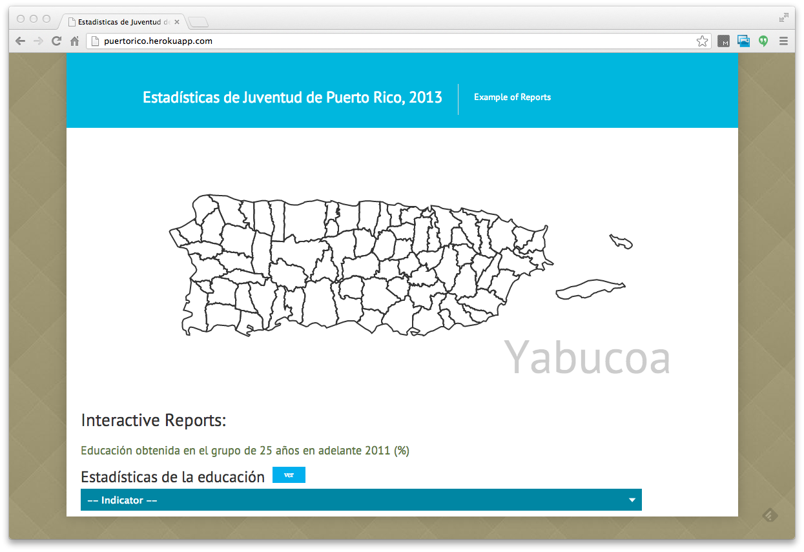
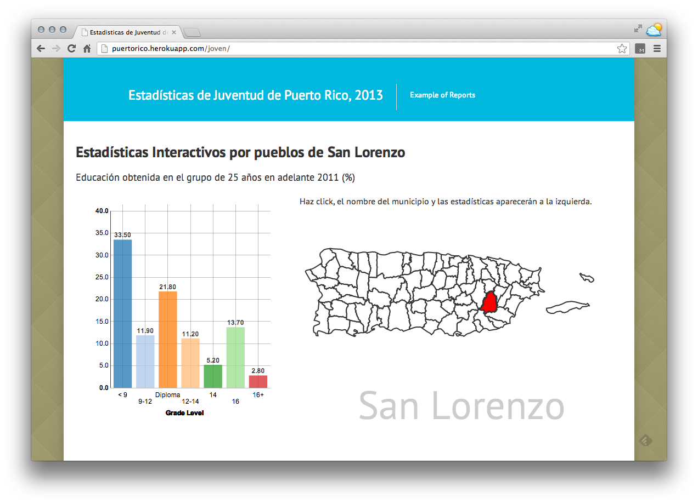

#Data Joven

This app streamlines the data analysis process for the Institute of Youth Development API.

Goals of this app:
- Easily publish the data visualizations online.
- Allow the enduser to create their own filters for [API](www.pixelogicpr.com/PRYouthAPI) data

This app is built with python's django framework, AtlasPR javascript library, and the theme comes from Institute for Youth Development.

Demo: http://puertorico.herokuapp.com/

Interactive Reports: http://puertorico.herokuapp.com/joven/

